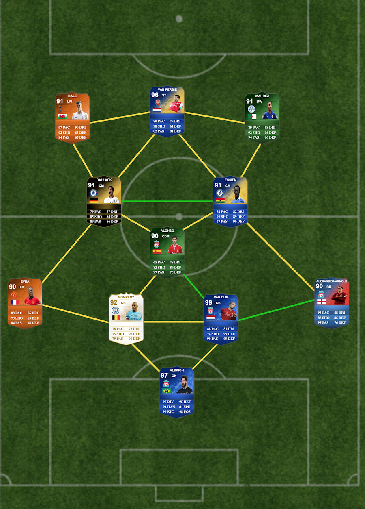

* **Make sure the angular cli is downloaded**
  * >ng --version
  * >npm install -g @angular/cli
* **clone the project**
  * >git clone https://github.com/ryanjackson10/custom-fifa-squad-builder.git
* **run the project**
  * >ng serve

custom squad builder using the FIFA 14 card aesthetics. Here are some of the example squads that I've made.

My all-time favorite Premier League Players to watch:

My all-time greatest Real Madrid XI:

My all-time best Premier League XI:

